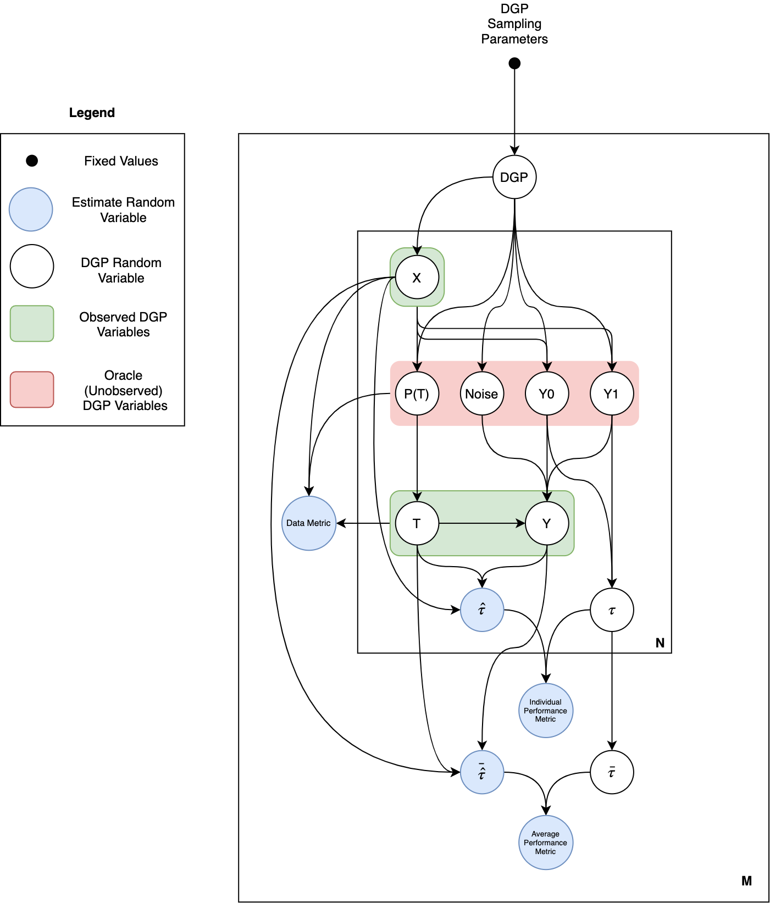

Design Goal, Approach, and Implementation Scheme
================================================

Design Goal
-----------

As established in Chapter 4 of the theory paper, most approaches to benchmarking methods for causal inference fall into one of two categories:

1. **Empirical methods** use real, observed covariate and outcome data. This data is typically drawn from randomized experiments so that ground truth effect values are known (although experiments only provide average effect estimates). In these benchmarks, there is a true Data Generating Process (:term:`DGP`) but it is latent and its properties are unknown. It is unclear if the data meets the typically required causal inference assumptions, especially after modifications like replacing the random control group with non-random data to create a *psuedo-observational* setting in which randomization, and the resultant expected covariate balance, doesn't hold.

2. **Synthetic methods** use covariate and outcome data generated from synthetic (hand-specificed rather as opposed to observed/empirical) distributions and functions. By definition, the DGP is known. As a result the true causal effects - both at the average and individual level - can be calculated directly and it is known if causal assumptions are met.

While both of these approaches have strengths and weaknesses, explored in detail in Chapter 4, they share a common flaw: their sample size is, effectively, one. In either design, a new causal inference method is tested against one or a few DGP (per targetted distributional setting). In empirical datasets, the properties of this DGP and, most importantly, its place in the :term:`distributional problem space`, are unknown. The causal inference method is validated against a single DGP 'sample' from an unknown location in the problem space. In synthetic datasets, the DGP properties - and its location in problem space - are known but, again, there is usually only one or a few DGPs per distributional setting.

In the best case, either of these approaches risks missing important aspects of estimator performance in the selected region of problem space by failing to average over variance in performance present in structurally similar DGPs. In the worst case, the results are biased - either by failure of empirical data to conform to basic causal assumptions or by manual specification using unrealistic data or unrepresentative/simplistic versions of DGP from the selected region (unintentially). In either scenario, benchmarking results are unlikely to generalize as indicators of consistent, real-world performance.

The primary design goal behind Maccabee's is to enable a benchmarking approach that mitigates the flaws of the common approach analyzed above.

Maccabee's Approach
-------------------

**High Level Description**

The approach proposed by this package is designed to mitigate the flaws above, thus improving the validity of causal inference benchmarks. This is achieved through the use of *sampled* Data Generating Processes, defined over real covariates, and drawn from parameterized distribution over functions that allows for control over the expected location in the :term:`distributional problem space`. This approach allows for:

* More thorough exploration of the distributional problem space (relative to empirical benchmarks) created by sampling DGPs from many different (known) locations in the problem space.

* More realistic covariates (relative to synthetic benchmarks) created by sampling DGP functions defined over empirical covariates.

* More robust results (relative to their approach) resulting from the averaging of performance evaluations across many DGPs selected, in a principled manner, from a region of problem space. Mitigating bias resulting from sensitivity to functional forms and the bias of hand-specificied of functions.

**Low Level Description**

At a more granular level of description, Maccabee samples treatment assignment and outcome functions, defined over a set of empirical covariates, from the class of *generalized, additive functions*. These are functions made up of the linear combination of (different) nonlinear `term types`. Each `term type` takes one of the following forms (containing one or more covariates): a two or three way interaction, a 2nd or 3rd degree polynomial, a discontinuous jump/kink. Covariates may appear in multiple terms, so the *universe* of concerte terms for each `term type` is all of the combinations of covariates that could appear in the form of the `term type`.

The treatment assignment function, untreated outcome and treatment effect functions are sampled from two, potentially different distributions parameterized by the (uniform) probability that each term in the universe of terms for each `term type` is selected to appear in the function (one probability per `term type`). Following initial term selection, there is an adjustment step that randomly selected terms to appear in both functions to meet a target alignment parameter (measured as the probability that a term in the outcome function also appears in the treatment assignment function).

By controlling the probability with which different term types appear in the treatment assignment and outcome function, as well as the overlap of terms between the functions, it is possible to sample functions that represent a wide (and controllable) range of linearity and confounding. Finally, numerical function normalization and linear modification (by multiplicative/additive constants) allows for control over the expected value of the treatment probability and potential outcomes, as well as the distribution of covariates across the treated/control groups and the heterogeneity of the treatment effect. Finally, control over the distributions from which treatment effects, outcome noise and co-efficient distribution are sampled from provides control over the scale and signal-to-noise ratio of the DGP functions.

Note that the degrees of freedom listed above correspond to the axes that make up the :term:`distributional problem space`. Therefore, by using the parameters that control these degrees of freedom, it is possible to generate DGPs that are - in expectation - located in different regions of the space. This, in turn, allows for better evaluation of new causal inference methods. Both by evaluating them across more regions in the problem space and more robustly in each region by sampling multiple, structurally similar DGPs and averaging out any function-specific effects.

Technical Design and Components
-------------------------------

The section above provided an overview of the approach taken by Maccabee. This section provides a more detailed description of how this approach is operationalized. The first subsection provides a formal description of the statistical model (and associated sampling procedure) that constitutes a Maccabee Monte Carlo benchmark. This is a description at the level of data (parameters and random variables). The second subsection then shows how the sampling procedure is implemented in the functions and classes that make up the package. This is a description at the level of the functional components used concretize, and sample from, the statistical model described in the first subsection.

Formal Statistical Model
++++++++++++++++++++++++

**Model Overview**

The figure below contains a graphical model that provides a formal, statistical description of Maccabee's benchmarking process. It explicates the relations between all of the (fixed) parameters and (sampled) random variables that are combined to produce a benchmark result (a Monte Carlo estimate of one or more metric defined over the estimand sampling distribution). This can be thought of as a description of the benchmarking process at the level of data that is completely generic with respect to the functions/distributions that relate/produce the data.

It is important to note that this model extends (and slightly modifies) the generic DGP statistical model proposed in Chapter 4 of the theory paper. That model included only the `DGP random variables` (and the relations between them). The model below extends that model to include the estimand sampling distribution and the performance metrics calculated over this distribution. As well as the data metrics that quantify the position of the DGP in the :term:`distributional problem space`. Three notational tools are used to make this extension:

* `DGP Random Variables` - that are part of the original generic DGP framework - are indicated in white while `Estimate Random Variables` - either estimands or metrics derived from these estimates - are in blue.

* Plate notation is used to indicate that each dataset includes `N` observations and that `M` such datasets, each drawn from a different DGP - are present in the benchmark described by the model. Each dataset has an associated set of performance and data metrics (that are themselves random variables). There is one metric value (for each metric) per dataset.

* The `DGP` random variable - sampled based on the `DGP Sampling Parameters` - represents the treatment and outcome mechanisms that connect the observed covariates to the *oracle* (latent/unobserved) treatment and outcome random variables. This variable stretches graphical notation, so it worth a brief discussion.

  Ordinarily the functions/distributions relating the covariate variable `X` to the treatment/outcome variables would be represented by the edges between these variables - each defined by fixed, parametric functional forms. In the Maccabee benchmarks, these functions/distributions are themselves sampled based on underlying parameters and distributions. As such, they are best represented as a Random Variable which conditions the value of the random variables that are related/generated by the DGP. The single `DGP` random variable can thus be thought of as a variable that abstracts lower level functional detail.

* Finally, it is worth noting that the estimator used to generate average/individual causal effect estimates from the observed outcome data is not explicitly depicted in this model. This estimator - whether stochastic or deteministic - is represented by the edges connecting the observed DGP variables to the individual/average estimate values.

**Model Sampling Procedure**

The graphical model above conveys the sampling procedure used to execute a Maccabee Monte Carlo benchmark. Moving from top to bottom:

* A set of `M` DGPs is sampled from function sampling distributions parameterized by the fixed `DGP Sampling Parameters` described above.

* A set of `N` covariate observations - each represented by the variable `X` - is drawn for each `DGP` (actually from the subcomponent of the DGP representing the joint distribution over covariate observations, the :math:`\rho` distribution in the theory paper).

* Each covariate observation `X` has an associated set of treatment assignment, outcome and causal effect random variables. Added to the observed covariates, these variable represent the complete observed and unobserved information about each individual observation in the dataset. The variables are sampled with slightly different dependencies as depicted in the model. Note that, for expositional clarity, the dependencies in the model are slightly different to the generic DGP approach outlined in the theory paper. The sampling procedure for each observation, and the differences relative to Chapter 4, are exlained below:

  * The `oracle` (unobserved) treatment probability (`P(T)`) is sampled conditioned on the covariate observation `X` and the treatment probability function (defined over `X`) from the sampled `DGP`. The `observed` treatment assignment - `T` - is then sampled conditioned on `P(T)`. In the theory paper, the treatment probability and treatment assignment are sampled using a single function referred to as :math:`\Omega`. Given that this function is likely to be composed of a propensity for treatment mechanism and a selection mechanism conditioned on this propensity, these two components are separated in the model and the implementation below.

  *  The `oracle` (unobserved) potential outcome variables (`Y1` and `Y0`) are sampled conditioned on the covariate observation `X` and the outcome functions (defined over `X`) from the sampled `DGP`. This is true to Rubin's Potential Outcome framework as described in Chapter 2 but is not in line with generic DGP model from Chapter 4 or the actual sampling implementation below. In both of these, only the untreated outcome, `Y0`, is sampled from the untreated outcome function (:math:`\Phi`). This  value is them combined with a treatment effect sampled from the treatment effect function (:math:`\tau`) to produce the treated outcome, `Y1`. This procedure produces a much harder to parse model, so the model above is used instead. In this model, sampling proceeds as below.

  * The `oracle` (unobserved) outcome noise is sampled from the outcome noise distribution from the sampled `DGP`.

  * The `observed` outcome variable - `Y` - is sampled conditioned on the treatment assignment, potential outcomes and outcome noise.

  * The individual causal effect variable - :math:`\tau` - is (deterministically) sampled conditioned on the potential outcome variables. Note, again, that in the generic DGP and the implementation below, the individual treatment effect is sampled from the treatment effect function - :math:`\tau`.

* Causal estimand values can be sampled at the individual observation or dataset level. At the individual level, `N` individual effect estimates :math:`\hat{\tau}` are sampled from a (deterministc/stochastic) estimator conditioned on each `X`, `T` and `Y`. At the dataset level, a single average effect estimand :math:`\bar{\hat{\tau}}` is sampled from a (deterministc/stochastic) estimator conditioned on all `N` of the `X`, `T` and `Y` observations.

* Following estimand sampling, `M` Individual or Average Performance Metric values are calculated (deterministically sampled) at the dataset level by combining the causal effect estimate values with the appropriate ground truth value(s) - :math:`\tau` or :math:`\bar{\tau}` respectively.

* Additionally, `M` Data Metrics are calculated by combining some/all of the covariate data with the observed and oracle outcome data.

Maccabee's Sampling Implementation
+++++++++++++++++++++++++++++++++++

The figure below
The bolded text signifies Maccabee classes/modules and link to detailed documentation for the relevant component.

To perform a **Benchmark** (:mod:`~maccabee.benchmarking`), one or more sets of **Sampling Parameters** (:mod:`~maccabee.parameters`) are using by the **DGP Sampler** (:mod:`~maccabee.data_generation.data_generating_process_sampler`) to sample **DGPs** (:mod:`~maccabee.data_generation.data_generating_process`) at a specific location in the :term:`distributional problem space`. **Data sets** (:mod:`~maccabee.data_generation.generated_data_set`) are then sampled from the sampled DGPs. The location of these data sets in the problem space is evaluated using **Data Metrics** (:mod:`~maccabee.data_analysis.data_metrics`). **Causal Models** (:mod:`~maccabee.modeling.models`) are used to generate estimates for a selected causal estimands. The performance of the models is evaluated against the ground truth from the sampled data sets using **Performance Metrics** (:mod:`~maccabee.modeling.performance_metrics`). The results of repeated DGP and data set samples are aggregated and returned to the user.

Design Principles
-----------------

Fundamentally, this package only succeeds if it provides a useful and usable way to benchmark new methods for causal inference developed by its users. Maccabee’s features are focused around four design principles to achieve this end:

* **Minimal imposition on method design:** attention has been paid to ensuring model developers can use their own empirical data and models with Maccabee painlessly. This includes support for benchmarking models written in both Python and R to avoid the need for language translation.

* **Quickstart but powerful customization:** The package includes high-quality data and pre-tuned parameters. This means that little boilerplate code is required to run a benchmark and receive results. This helps new users understand, and get value out of, the package quickly. At the same time, there is a large control surface to give advanced users the tools they need to support heavily-customized benchmarking processes.

* **Support for optimized, parallel execution:** valid Monte Carlo benchmarks require large sample sizes. In turn, this requires effecient, optimized code and the ability to access and utilize sufficient computational power. Maccabee provides code compilation for sampled DGPs - which greatly improves execution time - and parallelization tools that enable execution across multiple cores. Together, these tools make large-sample benchmarks feasible.

* **Smooth side-by-side support of old and new approaches:** Maccabee allows for user-specified DGPs to be used side by side with the sampled DGPs enabled by the package. This allows users to switch between/compare the new and old approaches while using a single benchmarking tool. It also allows users to exploit the advanced functionality outlined above even if they don’t use the core sampling functionality.

Objects
-------

The figure below...

The bolded text signifies Maccabee classes/modules and link to detailed documentation for the relevant component.

To perform a **Benchmark** (:mod:`~maccabee.benchmarking`), one or more sets of **Sampling Parameters** (:mod:`~maccabee.parameters`) are using by the **DGP Sampler** (:mod:`~maccabee.data_generation.data_generating_process_sampler`) to sample **DGPs** (:mod:`~maccabee.data_generation.data_generating_process`) at a specific location in the :term:`distributional problem space`. **Data sets** (:mod:`~maccabee.data_generation.generated_data_set`) are then sampled from the sampled DGPs. The location of these data sets in the problem space is evaluated using **Data Metrics** (:mod:`~maccabee.data_analysis.data_metrics`). **Causal Models** (:mod:`~maccabee.modeling.models`) are used to generate estimates for a selected causal estimands. The performance of the models is evaluated against the ground truth from the sampled data sets using **Performance Metrics** (:mod:`~maccabee.modeling.performance_metrics`). The results of repeated DGP and data set samples are aggregated and returned to the user.

Glossary of Terms
-----------------

TODO: finish these.

.. glossary::

    Causal Model
      A causal model implements a mathematical estimator which extracts a causal estimand from an observational data set.

    Data Metric
      Data Metrics are real-valued functions which measure some distributional property of a generated data set. Each data metric measures the position of the data set along some well-defined 'axis' of the distributional problem space. Each axis may have more than one corresponding data metric.

    DGP
      A Data Generating Process describes the mathematical process which gives rise to a set of observed data - covariates, treatment assignments, and outcomes - and the corresponding unobserved/oracle data, primarily the treatment effect.

      Concretely, a DGP relates the DGP Variables - defined in the constants group :class:`~maccabee.constants.Constants.DGPVariables` - through a series of stochastic/deterministic functions. The nature of these functions defines the location of the resultant data sets in the :term:`distributional problem space`.

    Distributional Problem Space
      The performance of causal estimators depends on distributional properties of the observed data. The space of all possible distributional properties forms the distributional problem space. The performance of an estimator across the space and in specific regions is of interest to researchers.

    Distributional Problem Space Axis
      The :term:`distributional problem space` is defined by axes which represent the distributional properties and the values they can take on. The cartesian product of the values the axes can take out is the extent of the problem space.

    Distributional Setting
      A location in the :term:`distributional problem space` characterized by a specific position along each :term:`distributional problem space axis`.

    DSL
      TODO - domain specific language.

    DGP Variable
      DGP variables are the variables over which the DGP is defined. See chapter 3 and 4 of the theory work.

    Observable DGP Variable
      DGP variables which are available for causal inference.

    Oracle DGP Variable
      DGP variables which are not available for causal inference but which can be thought of as 'existing' during the data generation process. This includes potential outcomes, treatment effect, outcome noise etc.

    Parameter Specification File
      A file used to specify a set of DGP sampling parameters. The specification conforms to the schema laid out in the :term:`parameter schema file`.

    Default Parameter Specification File
      The file which specifies the default set of DGP sampling parameters. This is laid out as a standard :term:`parameter specification file`.

    Parameter Schema File
      The file which defines all of the DGP sampling parameters by providing names, types, validity conditions, and descriptions. The :term:`parameter specification file` specifies DGP sampling parameters that conform to the schema laid out in this file.

    Performance Metric
      Performance Metrics are real-valued functions which measure the quality of a causal estimator by comparing the estimand value to the ground truth. A performance metric may be well defined for a single estimand value but typically, in the context of this package, they are defined over a sample of estimand values with each estimand value corresponding to an estimate of the causal effect/s in a generated data set.

    Transformed Covariate
      TODO - transformed covariate

    YML
      YAML is a human-readable data-serialization language. It is commonly used for configuration files and in applications where data is being stored or transmitted (Wikipedia).
