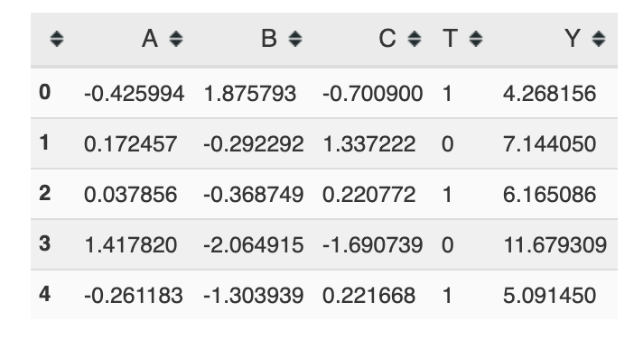

Benchmarking with a Concrete DGP
================================

The :doc:`walkthrough` section implicitly relied on sampled DGPs (sampled from a distribution specified by one or more parameterizations). While this approach is central to Maccabee's benchmarking philosophy, it is also possible to run benchmarks using a concretely specified DGP. This may be useful if you want to compare sampled DGP results to previous results from concrete DGPs in the same execution environment or if you want to make use of Maccabee's cluster computing or result management infrastructure.

The Maccabee DSL for Specifying Concrete DGPs
------------------------------------------------

Using a concrete DGP requires manual specification of the data generating process. Maccabee provides a light DSL - a domain specific language - which wraps standard python methods to make this specification as easy as possible and render the DGP code effectively self-documenting. This DSL wrapping allows Maccabee to handle most of the boilerplate involved in sampling from the DGP and ensures compatibility of the DGP with the rest of the functionality in the package.

The code below specifies a concrete DGP with three normally distributed covariates, a linear outcome function and a linear treatment assignment logit function::

  from maccabee.data_generation import DataGeneratingProcess, data_generating_method
  from maccabee.constants import Constants
  from maccabee.utilities import evaluate_expression
  import numpy as np
  import sympy as sp
  import pandas as pd

  class CustomConcreteDataGeneratingProcess(DataGeneratingProcess):
      def __init__(self, n_observations):

          super().__init__(n_observations, data_analysis_mode=False)

          # Three covariates - A, B and C.
          self.n_vars = 3
          self.covar_names = ["A", "B", "C"]
          self.A, self.B, self.C  = sp.symbols(self.covar_names)

          # Linear treatment assignment logit
          self.treatment_assignment_function = 1/(1 + sp.exp(-1*(self.A + self.B)))

          # Linear untreated outcome function.
          self.base_outcome_function = 4*self.C

      @data_generating_method(Constants.COVARIATES_NAME, [])
      def _generate_observed_covars(self, input_vars):
          X = np.random.normal(loc=0.0, scale=1.0, size=(
              self.n_observations, self.n_vars))

          return pd.DataFrame(X, columns=self.covar_names)

      @data_generating_method(Constants.PROPENSITY_SCORE_NAME,
                              [Constants.COVARIATES_NAME])
      def _generate_true_propensity_scores(self, input_vars):
          observed_covariate_data = input_vars[Constants.COVARIATES_NAME]

          return evaluate_expression(
              self.treatment_assignment_function,
              observed_covariate_data)

      @data_generating_method(
          Constants.POTENTIAL_OUTCOME_WITHOUT_TREATMENT_NAME,
          [Constants.COVARIATES_NAME])
      def _generate_outcomes_without_treatment(self, input_vars):
          observed_covariate_data = input_vars[Constants.COVARIATES_NAME]

          return evaluate_expression(
              self.base_outcome_function,
              observed_covariate_data)

      @data_generating_method(Constants.OUTCOME_NOISE_NAME, [])
      def _generate_outcome_noise_samples(self, input_vars):
          return np.random.normal(loc=0, scale=100, size=self.n_observations)

      @data_generating_method(
          Constants.TREATMENT_EFFECT_NAME,
          [Constants.COVARIATES_NAME])
      def _generate_treatment_effects(self, input_vars):
          return 2

Note that the ``CustomConcreteDataGeneratingProcess`` inherits from ``DataGeneratingProcess`` and overrides the parent class's ``_generate_*()`` methods. Each ``_generate_*()`` method in the class is decorated with an indication of the variable it produces and the variables on which it depends. The variables on which a method depends are passed into the method at execution time. For more detail on the Maccabee DSL, see the ``DataGeneratingProcess`` reference.

Generating Data
---------------

With the DGP specified, we can perform a quick manual data generation to ensure things are working the way we intend::

  concrete_dgp = CustomConcreteDataGeneratingProcess(n_observations=100)
  dataset = concrete_dgp.generate_dataset()

>>> dataset.observed_data.head()

The table above shows the three covariates, and a treatment and outcome which are roughly in line with expectations. Given the linearity of the model, we would expect a logistic regression to recover the true ATE and, indeed, it does:

>>> dataset.ATE # ground truth
2.0

>>> from maccabee.modeling.models import LinearRegressionCausalModel
>>> model = LinearRegressionCausalModel(dataset)
>>> model.fit()
>>> model.estimate_ATE() # estimate
2.0

Running a Benchmark
--------------------

**Note:** the API here will change following a rationalize of the covariate generation process. Right now, a concrete DGP is responsible for generating its own covariate observations which change with each sample while a sampled DGP has fixed covariates. When these are aligned, it will be possible to use a single benchmarking function with consistent metric calculation procedures (not possible right now).

We're now ready to run a benchmark. The code is only loosely analogous to the sample-based benchmark in the :doc:`walkthrough` section. We still supply a model class, estimand and number of samples to take from the DGP. But the concrete specification of the DGP means we only supply the DGP instance rather than sampling parameters and a data source::

  from maccabee.modeling.models import LinearRegressionCausalModel

  result = run_concrete_dgp_benchmark(
      dgp=concrete_dgp,
      model_class=LinearRegressionCausalModel,
      estimand=Constants.Model.ATE_ESTIMAND,
      num_samples_from_dgp=100)

As one would expect for such a simple DGP, the absolute mean bias and RMSE are both zero:

>>> result['absolute mean bias %']
3.1086244689504387e-15

>>> result["root mean squared error"]
1.9625527686514803e-15
