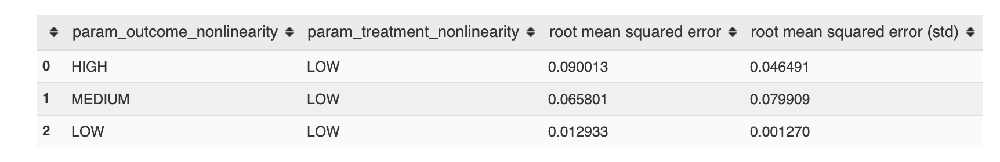

Intro & Overview
======================

This is an introductory overview of Maccabee's features and functionality. It provides minimal detail focusing instead on providing a big picture sense of the tools Maccabee provides.

**NOTE:** linking to function/class definitions is not yet in place in the docs below. It will be soon.

The Destination: Sampled DGP Benchmarks
---------------------------------------

The code below demonstrates the core of Maccabee's functionality - exploring a set
of different, well-defined distributional settings by sampling synthetic functions defined over supplied covariate data, generating treatment and outcome data, and then collecting estimator performance in each setting.

As you can see, Maccabee makes this complex process extremely easy::

  from maccabee.constants import Constants
  from maccabee.data_sources import data_sources
  from maccabee.benchmarking import run_sampled_dgp_benchmark

  LOW, MEDIUM, HIGH = Constants.AxisLevels.LEVELS

  param_grid = {
    Constants.AxisNames.TREATMENT_NONLINEARITY: [HIGH, MEDIUM, LOW],
    Constants.AxisNames.OUTCOME_NONLINEARITY: [HIGH, MEDIUM, LOW]
  }

  normal_data_source = data_sources.build_random_normal_datasource(
    n_covars=10,
    n_observations=750)

  results = run_sampled_dgp_benchmark(
    model_class=LinearRegressionCausalModel,
    estimand=Constants.Model.ATE_ESTIMAND,
    data_source_generator=normal_data_source,
    param_grid=param_grid,
    num_dgp_samples=10,
    num_data_samples_per_dgp=20)

Running ``pd.DataFrame(results)`` produces the following table (sorted by RMSE):

The results are consistent with the well known fact that the performance of a linear regression estimator degrades as the non-linearity of the outcome function increases.

In the code above, the user has supplied:

* A model which will be 'fit' to the data to estimate causal effects - in this case a simple ``LinearRegressionCausalModel``.
* A targeted estimated, in this case the ATE.
* A ``DataSource``, in this case one that contains 10 independent, random-normal covariates.
* A set of parameter combinations in terms of various levels of treatment and outcome function non-linearity.

With these choices made, the ``run_sampled_dgp_benchmark`` function can be used
to:

1. Sample Data Generating Processes, defined over the covariates in the data source, which conform to each of the desired parameter combinations. ``num_dgp_samples`` different DGPs will be sampled and each will be used to generate ``num_data_samples_per_dgp`` different datasets.
2. Fit the model and produce the estimated value of the ATE estimand.
3. Compare the estimated value to the ground truth and collect performance metrics.

With this destination in mind, we can take a few steps back to understand the various components of the benchmarking procedure displayed above.

Model Specification
-------------------

Although it is not displayed above, the first step in using Maccabee is to define a ``Model``. Model's represent causal inference methods, they are fit to a dataset and produce an estimate of one or more estimands.

The definition of the ``LinearRegressionCausalModel`` used above is below. All models take a `DataSet` object at construction time and implement ``fit()`` and ``estimate_*()`` functions. Arbitrary code can be run at initialization, fit and estimate time.

.. code-block:: python

  from sklearn.linear_model import LinearRegression

  class LinearRegressionCausalModel(CausalModel):
      def __init__(self, dataset):
          self.dataset = dataset
          self.model = LinearRegression()
          self.data = dataset.observed_data.drop("Y", axis=1)

      def fit(self):
          self.model.fit(self.data, self.dataset.Y)

      def estimate_ATE(self):
          # The coefficient on the treatment status
          return self.model.coef_[-1]

Data Sources
-------------

The second step is supplying a data source. Fundamentally, a ``DataSource`` is defined by a set of covariate observations. Under the hood, the ``DataSource`` object is responsible for concretizing stochastically defined covariate specification and for the data normalization and management required for DGP sampling. The vast majority of users will not need to worry about the specifics of these processes because the ``data_sources`` module contains a number of ready to use ``DataSource`` generators. These correspond to:

1. High-quality empirical data - accessible via ``build_lalonde_datasource()`` and ``build_cpp_datasource()`` (*with more to come*). See the theory paper for a discussion on these datasets .
2. Random normal covariates with user-controlled degree of pair-wise correlation. See ``load_random_normal()``.
3. Utilities for loading covariates from CSV files and automating the normalization and processing - see ``load_csv()``.

For these common use cases, building a ``DataSource`` is as simple as::

  from maccabee.data_sources import build_lalonde_datasource
  data_source = build_lalonde_datasource()

Parameter Specification
------------------------

The final step in running a sampled DGP benchmark is providing the parameter specification which controls the DGP sampling process. At this stage, specification can only be done by specifying a ``scikit-learn`` style parameter-grid. This is a dictionary where each entry in the dictionary is a parameter name and its value is a list of 'levels' for the parameter - high, medium, or low. Every combination of parameter levels present in the grid will be run in the benchmark.

The parameters below are available to control the nature of the sampled DGPs and the resulting distributional setting of the observed data. See the theory paper for a discussion on how these parameters correspond to the axes of the causal inference distributional problem space.

#. Outcome Nonlinearity: ``Constants.AxisNames.OUTCOME_NONLINEARITY``
#. Treatment Effect Heterogeneity: ``Constants.AxisNames.TE_HETEROGENEITY``
#. Treatment Nonlinearity: ``Constants.AxisNames.TREATMENT_NONLINEARITY``
#. Percent Treated: ``Constants.AxisNames.PERCENT_TREATED``
#. Covariate Overlap: ``Constants.AxisNames.OVERLAP``
#. Covariate Balance: ``Constants.AxisNames.BALANCE``
#. Outcome/Treatment Function Alignment: ``Constants.AxisNames.ALIGNMENT``

The parameter grid below would explore every combination of parameters available in Maccabee::

  param_grid = {
    Constants.AxisNames.OUTCOME_NONLINEARITY: [HIGH, MEDIUM, LOW],
    Constants.AxisNames.TE_HETEROGENEITY: [HIGH, MEDIUM, LOW]
    Constants.AxisNames.TREATMENT_NONLINEARITY: [HIGH, MEDIUM, LOW]
    Constants.AxisNames.PERCENT_TREATED: [HIGH, MEDIUM, LOW]
    Constants.AxisNames.OVERLAP: [HIGH, MEDIUM, LOW]
    Constants.AxisNames.BALANCE: [HIGH, MEDIUM, LOW]
    Constants.AxisNames.ALIGNMENT: [HIGH, MEDIUM, LOW]
  }

Benchmark Results
-----------------

By default, when running on the ATE estimand, the benchmark function returns the *absolute mean bias percentage* - the absolute value of mean bias across all the estimates from one DGP, averaged across the different DGPs - the root mean squared error, calculated analogously. See the theory paper for detail on these metrics. See the :doc:`../reference` section for details on ITE metrics and supplying custom metric functions.

Conclusion
----------

By specifying different ``Model`` classes, ``DataSource`` instances and combinations of parameter values, users can apply the power of sampled DGP benchmarking to a virtually limitless set of causal inference estimators. For detailed documentation of the objects and methods mentioned above, see the :doc:`/reference` section.
